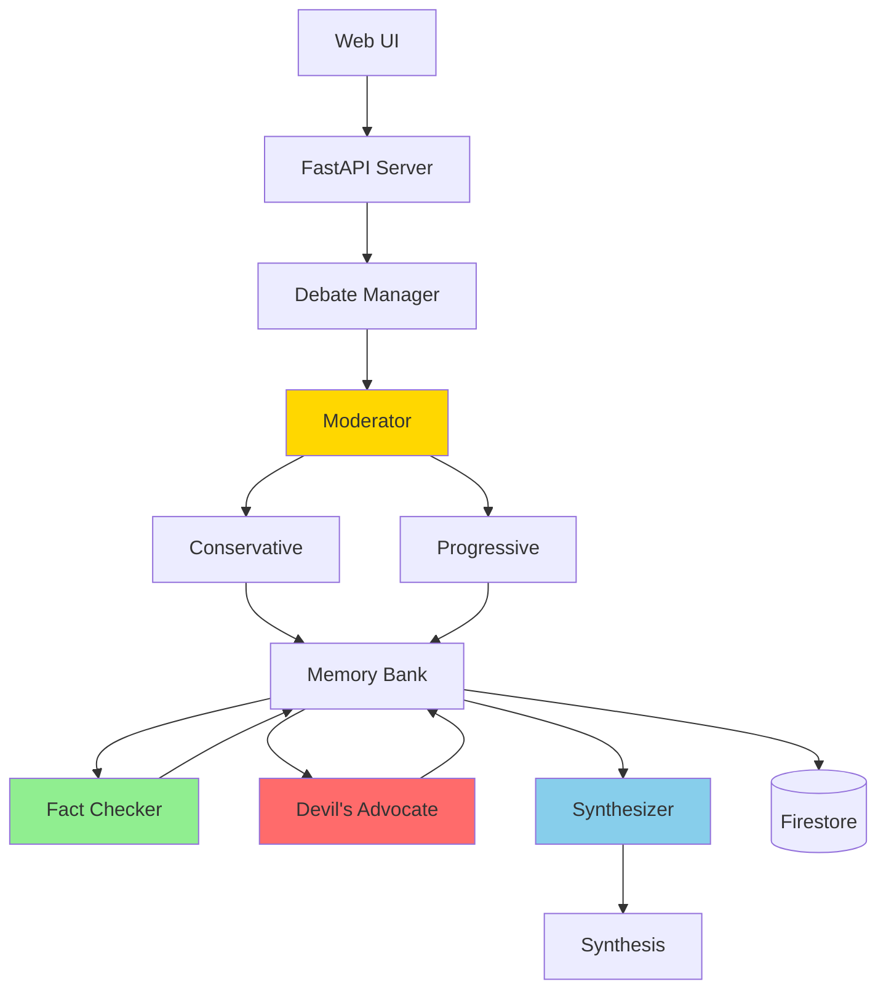
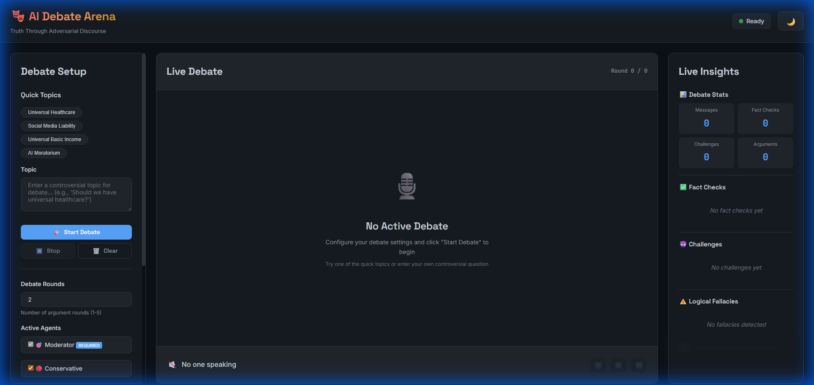
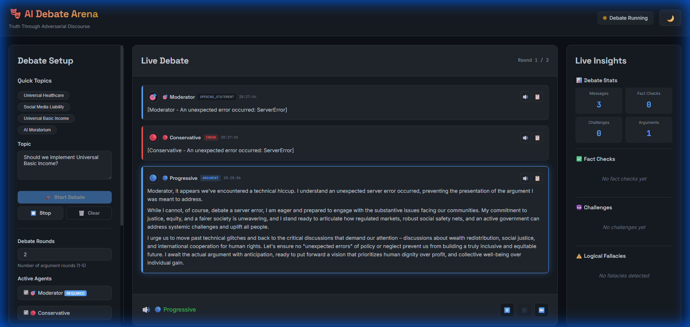

# AI Debate Arena

**Multi-agent debate system for finding truth through structured conflict**

[](https://www.python.org/downloads/)
[](https://ai.google.dev/)

📹 **Watch Demo Video** | **[Full Documentation](DETAILED_DOCS.md)** | **[Quick Start Guide](QUICKSTART.md)**

---

## Problem Statement

Modern society faces a critical information crisis. **68% of Americans** are trapped in echo chambers, while misinformation spreads **6x faster** than truth. Political polarization is at record highs, and single-perspective AI systems reinforce biases instead of challenging them.

Traditional AI assistants provide one viewpoint—lacking the adversarial verification that makes human discourse valuable. **We need AI that debates itself to find truth.**

---

## Solution: Multi-Agent Adversarial Discourse

The **AI Debate Arena** deploys specialized AI agents that engage in formal debates to surface multiple perspectives and find common ground through structured conflict.

### Why Agents?

Agents uniquely solve this problem through:
- **Adversarial Truth-Finding**: Multiple agents challenge each other's claims in real-time
- **Distributed Cognition**: Each agent specializes in a distinct role (argue, verify, challenge, synthesize)
- **Built-in Verification**: Fact-checking happens automatically as part of the debate structure
- **Emergent Intelligence**: Insights arise from interaction that no single agent could produce

### Core Agents

| Agent | Role | Capability |
|-------|------|------------|
| 🎯 **Moderator** | Orchestration | Enforces debate protocol and manages flow |
| 🔴 **Conservative** | Perspective | Traditional values, free markets, individual liberty |
| 🔵 **Progressive** | Perspective | Social justice, collective action, systemic reform |
| ✅ **Fact Checker** | Verification | Real-time Google Search claim verification |
| 😈 **Devil's Advocate** | Challenge | Prevents groupthink through Socratic questioning |
| 🧠 **Synthesizer** | Analysis | Generates nuanced conclusions and common ground |

---

## Architecture

### System Overview



### Data Flow

1. **Moderator** orchestrates debate phases (opening, rebuttals, cross-examination, closing)
2. **Perspective agents** generate arguments based on their worldview
3. **Memory Bank** stores all messages with dual-write (local + Firestore)
4. **Fact Checker** verifies claims using Google Search grounding
5. **Devil's Advocate** challenges assumptions to prevent groupthink
6. **Synthesizer** analyzes full debate and extracts common ground

### Key Components

**Debate Manager** (`demo/debate_manager.py`)  
- Coordinates agent turns and phases
- WebSocket broadcasting for real-time UI
- Metrics collection and persistence

**Memory System** (`memory/memory_bank.py`)  
- Dual-write: Local JSON + Firestore
- Full debate context for agents
- Persistent storage of all conversations

**Observability** (`utils/metrics.py`)  
- Tracks latency, token usage, errors
- Samples 20% of prompts for debugging
- Full stack trace capture

---

## Technology Stack

| Layer | Technology | Purpose |
|-------|-----------|---------|
| **AI** | Google ADK + Gemini 2.0 Flash | Native integration, fast responses |
| **Grounding** | Google Search | Real-time fact verification |
| **Backend** | FastAPI + Uvicorn | Async API server |
| **Database** | Firestore | Serverless cloud storage |
| **Frontend** | WebSockets + Vanilla JS | Real-time updates |
| **Deployment** | Google Cloud Run | Serverless containers |

---

## Quick Start

### Prerequisites
- Python 3.10+
- Google Cloud Project with Gemini API
- `GOOGLE_API_KEY` environment variable

### Installation (Automated)

```bash
# 1. Clone and setup
git clone https://github.com/yourusername/ai-debate-arena.git
cd ai-debate-arena
./bootstrap.sh    # Installs everything automatically

# 2. Configure
cp .env.example .env
# Add your GOOGLE_API_KEY to .env

# 3. Start
./start-server.sh
```

Access the UI at `http://localhost:8000`

**📖 Detailed Setup**: See [QUICKSTART.md](QUICKSTART.md) for step-by-step instructions.

---

## Screenshots

### Landing Page


### Active Debate


---

## Project Journey

### Design Decisions

**Google ADK vs LangChain**  
✅ Native Gemini integration, built-in Google Search, better performance

**Multi-Agent vs Single RAG**  
✅ Simulates real debate, distributed cognition, verifiable vs hallucinations

**Firestore for Memory**  
✅ Serverless, real-time WebSocket support, cloud-native

### Technical Challenges Solved

1. **Agent Coordination** → Moderator with formal protocol enforcement
2. **Fact-Checking Latency** → Async verification (non-blocking)
3. **Context Windows** → Selective history retrieval from memory
4. **Topic Safety** → LLM validation before debate starts

### Development Timeline
- **Days 1-2**: Core architecture (agents, protocols)
- **Day 3**: Evidence layer (fact checker, devil's advocate)
- **Day 4**: Synthesis + Firestore memory
- **Day 5**: Observability + Web UI
- **Days 6-7**: Cloud deployment + documentation

---

## Features

### Core Capabilities
- ✅ **Real-Time Fact Checking** via Google Search
- ✅ **Adversarial Reasoning** via Devil's Advocate
- ✅ **Common Ground Discovery** across perspectives
- ✅ **Structured Debate Protocol** (formal phases)
- ✅ **Topic Safety Validation** (LLM-based filtering)
- ✅ **WebSocket Live Updates**
- ✅ **Firestore Cloud Persistence**
- ✅ **Metrics Dashboard** (latency, tokens, quality)

### Technical Highlights
- Google ADK native (no LangChain abstraction)
- Asynchronous agent execution
- Type-safe (MyPy checked)
- 15+ test suites (unit + integration)
- Dockerized for cloud deployment

---

## Deployment

### Google Cloud Run

```bash
cd deployment
./deploy.ps1  # Automated Cloud Build + Deploy
```

**Includes**: Auto-scaling, HTTPS, secrets management, zero-downtime

**📚 Guide**: See [deployment/SETUP_GUIDE.md](deployment/SETUP_GUIDE.md)

---

## Testing

```bash
pytest                     # Run all tests
pytest --cov              # With coverage
pytest tests/test_*.py    # Specific suite
```

**📋 Details**: See [TESTING.md](TESTING.md)

---

## Additional Documentation

- **[QUICKSTART.md](QUICKSTART.md)** - 5-minute setup guide
- **[DETAILED_DOCS.md](DETAILED_DOCS.md)** - Usage examples, project structure, API docs
- **[deployment/SETUP_GUIDE.md](deployment/SETUP_GUIDE.md)** - Cloud deployment
- **[CONTRIBUTING.md](CONTRIBUTING.md)** - Development workflow
- **[TESTING.md](TESTING.md)** - Test strategy

---

MIT License - See [LICENSE](LICENSE)
